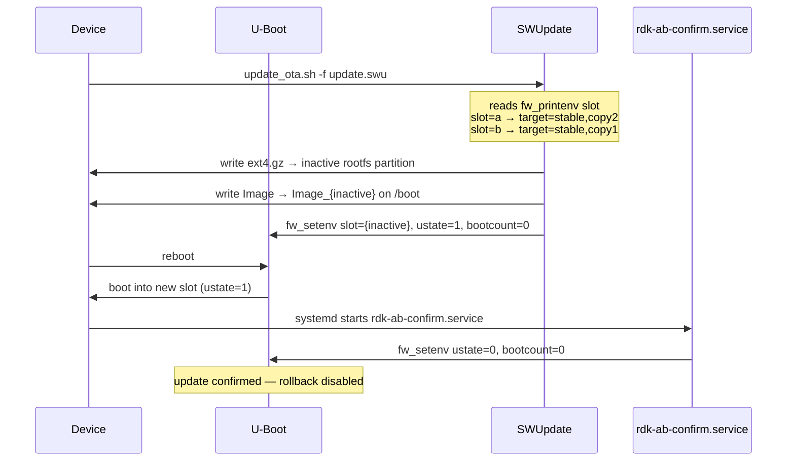

# RPI4 Firmware Update

## A/B Disk Layout

The SD card image is partitioned by `meta-rdk-optional/wic/sdimage-raspberrypi-ab.wks`:

```
mmcblk0p1  /boot      vfat  Shared boot partition (U-Boot, kernel Image_a / Image_b)
mmcblk0p2  /          ext4  Rootfs slot A
mmcblk0p3  /altroot   ext4  Rootfs slot B
mmcblk0p4  /data      ext4  Persistent data 
```

The active kernel is selected by U-Boot copying either `Image_a` or `Image_b` from the boot partition.

---

## U-Boot Environment Variables

Three variables in the U-Boot environment control the A/B state machine:

| Variable    | Values  | Meaning                                                      |
| ----------- | ------- | ------------------------------------------------------------ |
| `slot`      | `a`/`b` | Which slot to boot                                           |
| `ustate`    | `0`/`1` | `1` = update just applied, needs confirmation                |
| `bootcount` | `0`/`1` | Incremented each failed boot; `>3` triggers rollback. `rdk-ab-confirm` systemd service clears the `bootcount` value on successful start. |

Read/write with `fw_printenv` / `fw_setenv` (provided by `libubootenv-bin`).

---

## SWUpdate A/B Flow

The `.swu` package contains the rootfs (`ext4.gz`), the kernel (`Image`), and
`sw-description` which maps them to the inactive slot.



### Slot selection in `sw-description`

`meta-rdk-optional/recipes-core/swupdate/files/sw-description` defines two update targets:

- **`stable,copy1`** — writes rootfs to `mmcblk0p2`, kernel to `Image_a`, sets `slot=a`
- **`stable,copy2`** — writes rootfs to `mmcblk0p3`, kernel to `Image_b`, sets `slot=b`

`update_ota.sh` reads the *current* slot and targets the *other* one automatically.

### Rollback

U-Boot increments `bootcount` on every boot attempt. If `bootcount > 0` and `ustate == 1`
when U-Boot runs, it considers the update unconfirmed and switches back to the previous slot.
`rdk-ab-confirm.service` (runs early in userspace via `After=local-fs.target`) clears both
variables on a successful boot, preventing rollback. 

If `ustate == 0` but we failed to perform a full boot three times `bootcount == 3`, the rollback will be triggered.

---

## OTA Update Script (`update_ota.sh`)

Installed to `/usr/sbin/update_ota.sh` by the `rdk-ota-update` recipe.
Configured via `/etc/rdk-ota.conf`.

**Configuration** (`/etc/rdk-ota.conf`):

```sh
GITHUB_REPO="s57-dev/rdk-monorepo-build"   # owner/repo for GitHub Releases API
SWU_ASSET="rpi-package-swupdate"            # substring matched against asset filename
#SWUPDATE_HW="raspberrypi4-64-rdke:1.0"    # hardware compatibility string (default)
```

**Usage**:

```sh
update_ota.sh               # auto: fetch latest GitHub release
update_ota.sh -u <url>      # install from URL (.swu or .zip wrapping .swu)
update_ota.sh -f <file>     # install from local file
```


