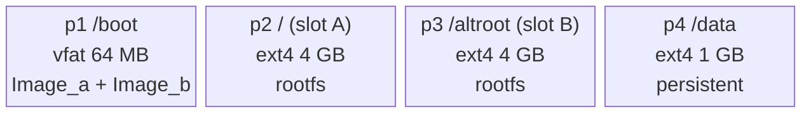
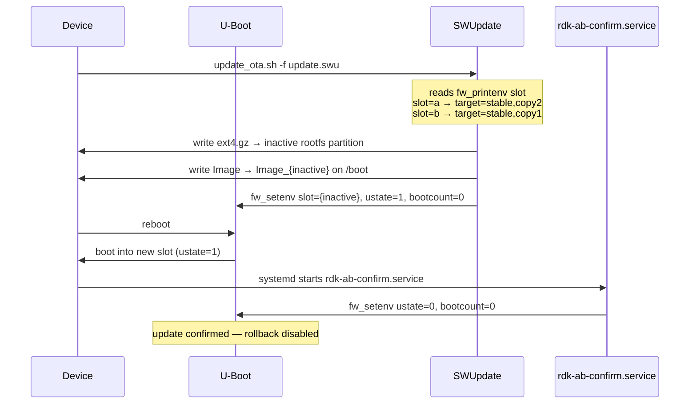
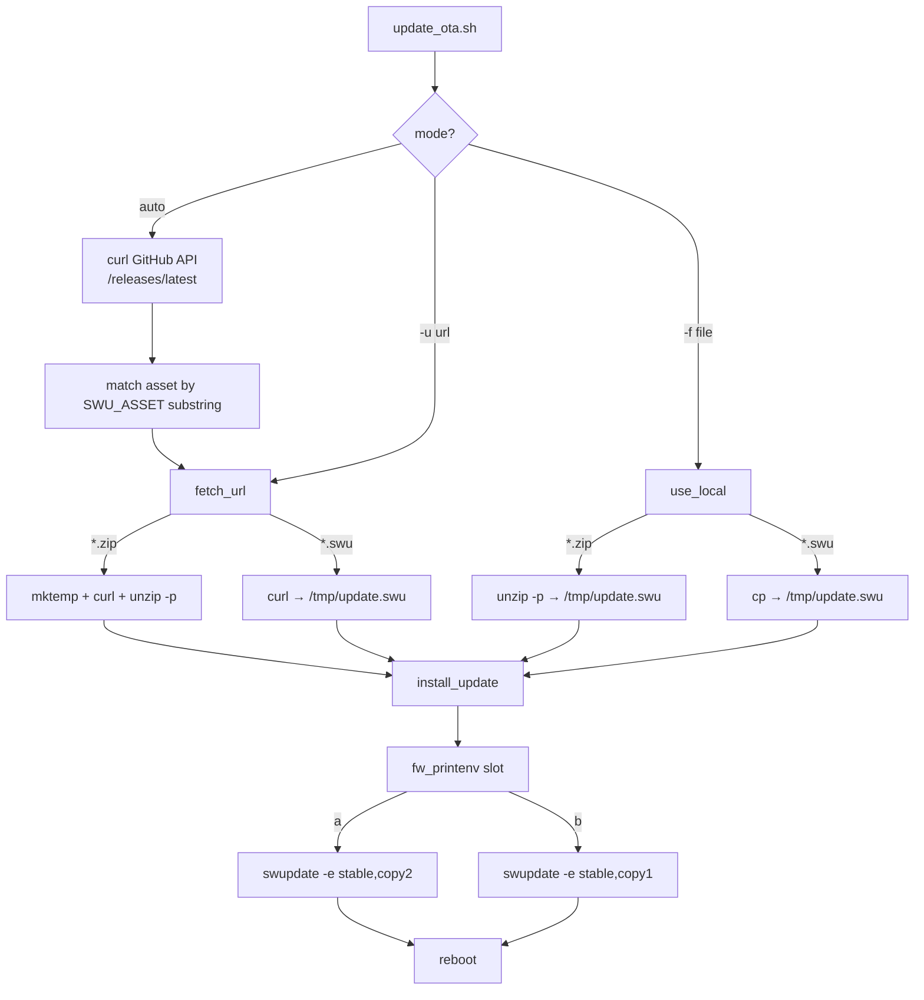
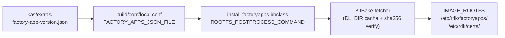

# Firmware Update & Factory App Deployment

## A/B Disk Layout

The SD card image is partitioned by `meta-rdk-optional/wic/sdimage-raspberrypi-ab.wks`:

```
mmcblk0p1  /boot      vfat   64 MB   Shared boot partition (U-Boot, kernel Image_a / Image_b)
mmcblk0p2  /          ext4  4096 MB  Rootfs slot A
mmcblk0p3  /altroot   ext4  4096 MB  Rootfs slot B
mmcblk0p4  /data      ext4  1024 MB  Persistent data (survives updates)
```



The active kernel is selected by U-Boot copying either `Image_a` or `Image_b` from the boot partition.
The active rootfs partition is selected by the U-Boot `slot` environment variable.

---

## U-Boot Environment Variables

Three variables in the U-Boot environment control the A/B state machine:

| Variable     | Values | Meaning                                      |
|--------------|--------|----------------------------------------------|
| `slot`       | `a`/`b`| Which slot to boot                           |
| `ustate`     | `0`/`1`| `1` = update just applied, needs confirmation|
| `bootcount`  | `0`/`1`| Incremented each boot; `>0` triggers rollback|

Read/write with `fw_printenv` / `fw_setenv` (provided by `libubootenv-bin`).

---

## SWUpdate A/B Flow

The `.swu` package (CPIO archive) contains the rootfs (`ext4.gz`), the kernel (`Image`), and
`sw-description` which maps them to the inactive slot.



### Slot selection in `sw-description`

`meta-rdk-optional/recipes-core/swupdate/files/sw-description` defines two update targets:

- **`stable,copy1`** — writes rootfs to `mmcblk0p2`, kernel to `Image_a`, sets `slot=a`
- **`stable,copy2`** — writes rootfs to `mmcblk0p3`, kernel to `Image_b`, sets `slot=b`

`update_ota.sh` reads the *current* slot and targets the *other* one automatically.

### Rollback

U-Boot increments `bootcount` on every boot attempt. If `bootcount > 0` and `ustate == 1`
when U-Boot runs, it considers the update unconfirmed and switches back to the previous slot.
`rdk-ab-confirm.service` (runs early in userspace via `After=local-fs.target`) clears both
variables on a successful boot, preventing rollback.

---

## OTA Update Script (`update_ota.sh`)

Installed to `/usr/sbin/update_ota.sh` by the `rdk-ota-update` recipe.
Configured via `/etc/rdk-ota.conf`.



**Configuration** (`/etc/rdk-ota.conf`):

```sh
GITHUB_REPO="s57-dev/rdk-monorepo-build"   # owner/repo for GitHub Releases API
SWU_ASSET="rpi-package-swupdate"            # substring matched against asset filename
#SWUPDATE_HW="raspberrypi4-64-rdke:1.0"    # hardware compatibility string (default)
```

**Usage**:

```sh
update_ota.sh               # auto: fetch latest GitHub release
update_ota.sh -u <url>      # install from URL (.swu or .zip wrapping .swu)
update_ota.sh -f <file>     # install from local file
```

---

## Version Info

`DISTRO_VERSION` is set at build time and propagates to two places on the device:

| Location | Variable | How to read |
|----------|----------|-------------|
| `/etc/os-release` | `VERSION_ID` | `cat /etc/os-release` |
| `.swu` `sw-description` | `version` field | visible in SWUpdate trace logs |

`DISTRO_VERSION` is controlled by the `BUILD_VERSION` environment variable injected by CI
(see `kas/extras/swupdate.yml`). Nightly builds use the git tag (`nightly-YYYYMMDD`); local
builds default to `8.0`.

---

## Factory App / Bolt Package Deployment

Bolt packages (`.bolt` files) are pre-built RDK applications installed into the rootfs at
**image creation time** — they are not installed via a package manager at runtime.

### How it works



1. `FACTORY_APPS_JSON_FILE` points to `kas/extras/factory-app-version.json`
2. `install-factoryapps` bbclass is enabled when `DISTRO_FEATURES` contains `enable_ralf`
   (set unconditionally in `rdke-rdkm-config.inc`)
3. During rootfs post-processing, `factory_apps_installer_run` reads the JSON manifest,
   fetches each asset via the BitBake fetcher (with SHA-256 verification), and copies it
   into `IMAGE_ROOTFS`

### JSON manifest format

`kas/extras/factory-app-version.json`:

```json
[
  {
    "packagename": "com.rdkcentral.base+0.2.0.bolt",
    "srcuri":      "https://repo.solution57.com/rdk-bolts/com.rdkcentral.base%2B0.2.0.bolt",
    "sha256sum":   "3c8febaf...",
    "installpath": "/etc/rdk/factoryapps"
  },
  {
    "packagename": "public-cert.pem",
    "srcuri":      "https://repo.solution57.com/rdk-bolts/keys/public-cert.pem",
    "sha256sum":   "5f1e4665...",
    "installpath": "/etc/rdk/certs"
  }
]
```

| Field         | Required | Description                                          |
|---------------|----------|------------------------------------------------------|
| `packagename` | yes      | Filename as installed on device (plain name, no `/`) |
| `srcuri`      | yes      | Any URL supported by BitBake fetcher                 |
| `sha256sum`   | yes      | 64-char hex SHA-256 of the file                      |
| `installpath` | yes*     | Absolute path in target rootfs (`*` or `FACTORY_APPS_PATH`) |

To update a bolt package: change the `srcuri` version and `sha256sum` in the JSON, then
rebuild the image. The new binary will be baked in at image creation time.
